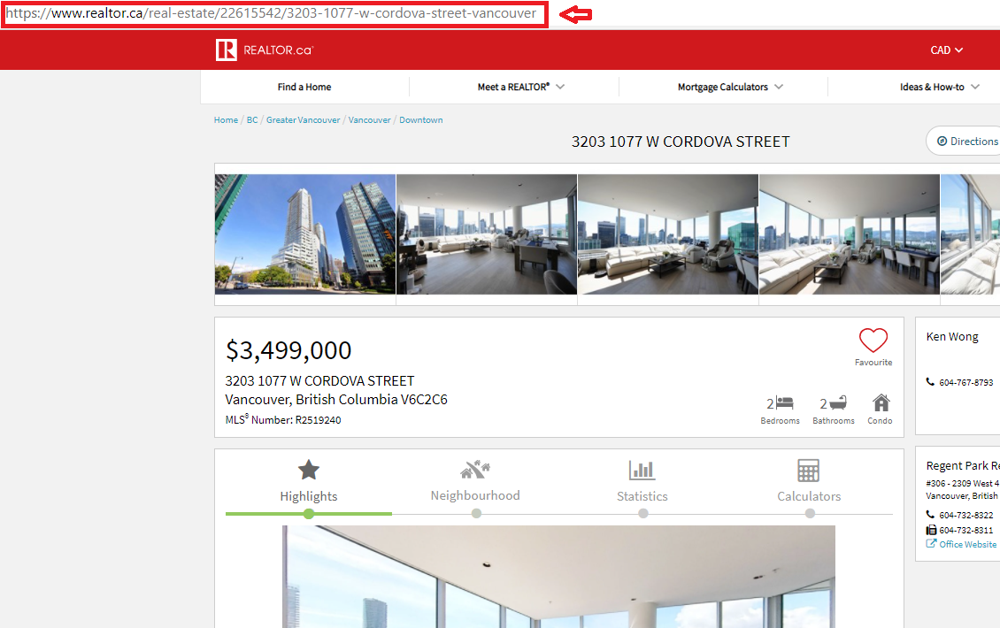

# realtor-watcher
Watching list of realtor.ca properties and notify you when the price changes

## How to use
In order to use this package, you first need to install the requirements. 
```bash
pip install -r requirements
```

Then, got to [Realtor.CA](https://realtor.ca) website and find your properties you want to add to your watach list, and copy their links. 


Append the link in the given CSV file `links.csv` under the `links` column. This scripts, will check all links and track the updates in the output `updates.txt` file and update the CSV file as well. If your are an Ubuntu user, you also can put the script in your cronjob so that this script, runs every 12 hours and give you updates. You can use: 
```bash
crontab -e
```  
and then add the following line at the end of your file:
```bash
@reboot /path/to/check_script.sh
```

### Note
You must also note that there are many unti robots programs running the realtors' websites. We are using some technqiues to bypass them and trying to add proxies in the next versions to tell all **publicly available data** to **public**.  


## Author
* [**Amin Aghaee**](https://github.com/aminrd/)